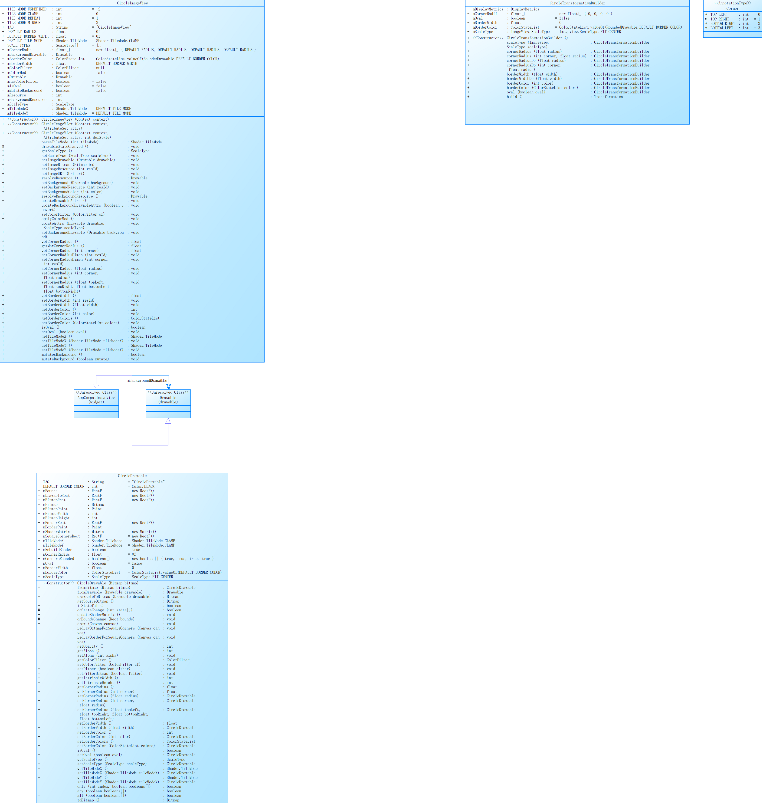

# CircleImageView
Android Library For CircleImageView

可以实现圆角矩形、圆形、椭圆图片

# 使用步骤

## 1. 在Module(通常app模块下)的build.gradle添加依赖

```
dependencies {
  compile 'cn.ltaoj.circleimageview:circleimageview:1.0.0'
}
```

## 2. 在布局文件中添加如下代码

```
<?xml version="1.0" encoding="utf-8"?>
<android.support.constraint.ConstraintLayout
    xmlns:android="http://schemas.android.com/apk/res/android"
    xmlns:app="http://schemas.android.com/apk/res-auto"
    android:layout_width="match_parent"
    android:layout_height="wrap_content">
    
    <cn.ltaoj.circleimageview.CircleImageView
        android:id="@+id/member_avatar"
        android:layout_width="@dimen/circle_image_size"
        android:layout_height="@dimen/circle_image_size"
        android:src="@mipmap/iv_default_avatar"
        android:scaleType="fitCenter"
        app:civ_corner_radius="10dip"
        app:civ_border_width="1dip"
        app:civ_border_color="@color/colorImageBorder"
        app:civ_oval="false"
        android:layout_margin="@dimen/activity_horizontal_margin"
        app:layout_constraintLeft_toLeftOf="parent"
        app:layout_constraintTop_toTopOf="parent"
        app:layout_constraintBottom_toBottomOf="parent"/>
        
</android.support.constraint.ConstraintLayout>
```

## 3. 新建Activity加载此布局文件即可

```
      CircleImageView civ = findViewById(R.id.member_avatar);
      // 可以调用civ的方法在代码中进行设置
      civ.setOval(true) // 设置为椭圆
```

# 属性文档

## **该控件相对于ImageView主要新增了下列属性**

|属性名|值类型|值范围|属性含义|
|------|---|---|---|
|civ_corner_radius|dp|整数|圆角半径|
|civ_corner_radius_top_left|dp|整数|左上角圆角半径|
|civ_corner_radius_top_right|dp|整数|右上角圆角半径|
|civ_corner_radius_bottom_left|dp|整数|左下角圆形半径|
|civ_corner_radius_bottom_right|dp|整数|右下角圆形半径|
|civ_border_width|dp|整数|边框宽度|
|civ_border_color|颜色|#00FF00、@color/colorGreen...|边框颜色|
|civ_mutate_background|boolean|true、false|如果为false，那么当多个图片引用统一布局时，其中一个图片实例改变，那么其他的引用对象也会发生改变。如果为true，那么当对其中一个实例改变时，并不会影响其他图片|
|civ_oval|boolean|true、false|是否椭圆|
|scaleType|特定字符串|fitCenter、fitXY等|缩放类型|
|civ_tile_mode|特定字符串|clamp、repeat、mirror|平铺模式|
|civ_tile_mode_x|特定字符串|clamp、repeat、mirror|X方向平铺模式|
|civ_tile_mode_y|特定字符串|clamp、repeat、mirror|Y方向平铺模式|

# 类图设计
**圆角矩形参照了开源实现，以下是学习过程中绘制的代码类图**


